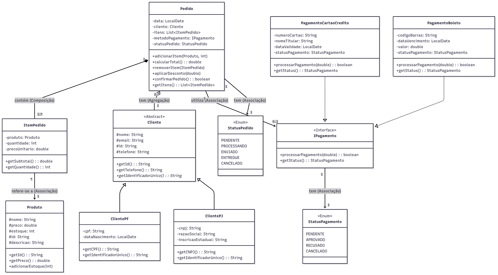

# Sistema de Pedidos - Projeto de Estudo em Java

Este projeto é uma aplicação de console que simula um sistema de gerenciamento de pedidos, desenvolvido para aplicar e demonstrar os principais conceitos da Programação Orientada a Objetos (POO) em Java.

O sistema modela as entidades e fluxos essenciais de um pequeno e-commerce, incluindo o cadastro de produtos, clientes, a criação de pedidos com múltiplos itens e o processamento de diferentes formas de pagamento.

## Conceitos de POO Aplicados

Este projeto serve como um exemplo prático dos pilares e boas práticas da POO:

*   **Abstração:** as classes como `Produto`, `Cliente` e `Pedido` abstraem conceitos do mundo real, focando apenas nos atributos e comportamentos relevantes para o sistema.
*   **Encapsulamento:** os atributos das classes são protegidos (privados), e o acesso a eles é controlado através de métodos públicos (`getters` e `setters`), garantindo a integridade dos dados.
*   **Herança:** a relação entre `Cliente`, `ClientePF` e `ClientePJ` demonstra como especializar uma classe base, reutilizando código comum e adicionando características específicas. A classe `Cliente` é `abstract`, garantindo que apenas clientes especializados possam ser criados.
*   **Polimorfismo:** a classe `Pedido` interage com a interface `IPagamento`. Ela não precisa saber se o pagamento é via `PagamentoCartaoCredito` ou `PagamentoBoleto`; ela simplesmente chama o método `processarPagamento`, e a JVM se encarrega de executar a implementação correta em tempo de execução.

## Estrutura do Projeto

O sistema é modelado através de um conjunto de classes e interfaces que se relacionam para formar a lógica de negócio. A estrutura principal é baseada no diagrama UML a seguir:



### Principais Componentes:

*   **Enums (`StatusPedido`, `StatusPagamento`):** utilizados para representar um conjunto fixo de estados, tornando o código mais seguro e legível.
*   **Entidades (`Produto`, `ItemPedido`):** representam os objetos de dados fundamentais do sistema. `ItemPedido` "congela" o preço do produto no momento da compra.
*   **Hierarquia de Clientes (`Cliente`, `ClientePF`, `ClientePJ`):** demonstra o uso de herança e classes abstratas para modelar diferentes tipos de uma mesma entidade.
*   **Estrutura de Pagamento (`IPagamento`, `PagamentoCartaoCredito`, `PagamentoBoleto`):** usa uma interface para definir um contrato de pagamento, permitindo que novas formas de pagamento sejam adicionadas no futuro sem alterar a classe `Pedido`.
*   **Classe Orquestradora (`Pedido`):** é a classe central que conecta todas as outras. Ela gerencia seu próprio ciclo de vida (status), contém uma lista de itens (Composição) e está associada a um cliente (Agregação) e a um método de pagamento.

## Como Executar o Projeto

Para executar a simulação, você precisa de um ambiente de desenvolvimento Java configurado (JDK 8 ou superior).

1.  **Compile as Classes:**
    Navegue até o diretório raiz do projeto (onde os arquivos `.java` estão localizados) e compile todos os arquivos com o comando:
    ```bash
    javac *.java
    ```
    *Observação: Se você organizou os arquivos em pacotes, o comando de compilação deverá ser ajustado de acordo.*

2. **Crie um Ponto de Entrada (`main`):**
    Para testar o fluxo, crie uma classe `poo.SistemaPedidos.java` com um método `main`, como no exemplo abaixo:

     ```java

    import org.springframework.boot.SpringApplication;
    import org.springframework.boot.autoconfigure.SpringBootApplication;
    import org.springframework.web.bind.annotation.GetMapping;
    import org.springframework.web.bind.annotation.RequestParam;
    import org.springframework.web.bind.annotation.RestController;
    
    @SpringBootApplication
    @RestController
    public class SistemaPedidos {
    
        public static void main(String[] args) {
            SpringApplication.run(SistemaPedidos.class, args);
        }
    
        @GetMapping("/hello")
        public String hello(@RequestParam(value = "name", defaultValue = "World") String name) {
            return String.format("Hello %s!", name);
        }
    }
    ```ação:**
    Após compilar novamente, execute a classe principal:
    ```bash
    java poo.SistemaPedidos
    ```

## Autores

*   **Sávio Teles** - *Desenvolvimento e Implementação* - [https://github.com/savioteles]

---
